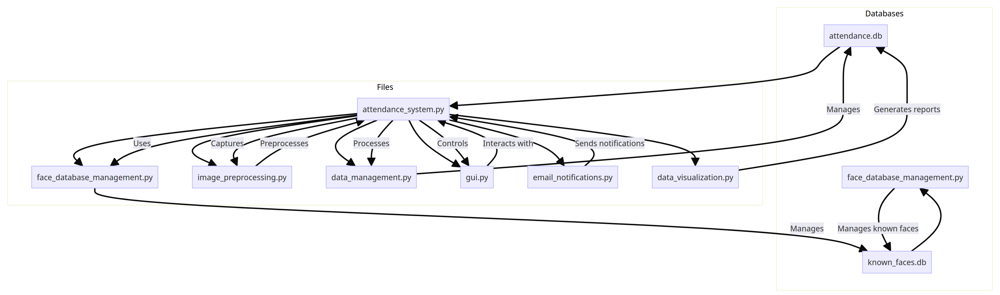

# Attendance System Project

This repository contains the source code and resources for an Attendance System based on Raspberry Pi.

## Project Components

The project consists of the following components:

- `attendance_system.py`: The main Python script for the attendance system.
- `gui.py`: The user interface script for controlling the system.
- `image_preprocessing.py`: Script for preprocessing captured images.
- `data_management.py`: Script for managing attendance data.
- `email_notifications.py`: Script for sending email notifications.
- `data_visualization.py`: Script for data visualization.
- `face_database_management.py`: Script for managing known faces.
- `known_faces.db`: Database for storing known faces.
- `attendance.db`: Database for logging attendance records.

## Flowchart

The flowchart above illustrates the interactions between the project components, files, and databases.

## Getting Started

To get started with this project, follow the instructions in the respective Python scripts. You may need to install required libraries and dependencies.

## Usage

- Run `attendance_system.py` to start the attendance system.
- Use `gui.py` to control and monitor the system.
- Customize and extend the project to suit your specific needs.

## License

This project is licensed under the MIT License - see the [LICENSE](LICENSE) file for details.
